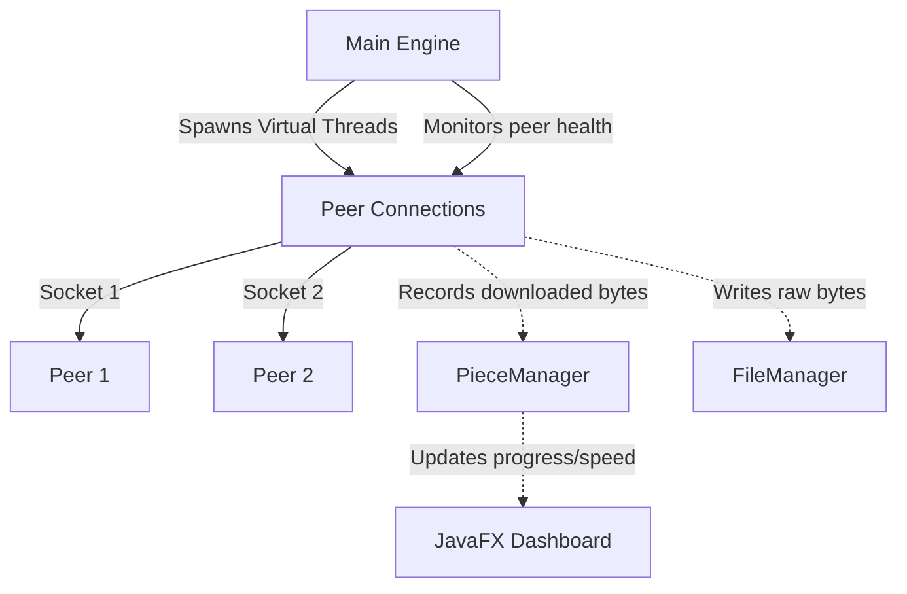

# System Architecture & Core Components

This project abandons traditional, heavy Thread Pools in favor of **Java 21 Virtual Threads**. This allows us to spawn hundreds of highly concurrent, lightweight socket connections without blocking the JavaFX Application Thread or consuming massive amounts of RAM.

Here is a visual breakdown of how the components talk to each other:



## 1. Engine Entry Point (`Main.java`)
`Main.java` is the orchestrator. When the user selects a `.torrent` file, `Main.runTorrent()` is triggered.
It initializes the core data structures and starts a permanent background thread that serves as the **Choke & Replenish Loop** (which handles the Tit-for-Tat algorithm and asks the tracker for more peers when connections die).

## 2. Central State (`PieceManager.java`)
Because dozens of peers are downloading blocks of data concurrently, we need a thread-safe "brain" to track what we have and what we need.

* **`peerPieces` (BitSet):** A fast, memory-efficient array of booleans tracking which pieces have been fully verified via SHA-1 hashing.
* **`AtomicLong totalBytesDownloaded`:** A thread-safe counter. Every time any peer thread receives a block of data, it adds to this counter:
  ```java
  public void recordBytesDownloaded(int bytes) {
      totalBytesDownloaded.addAndGet(bytes);
  }
  ```
  The UI thread reads this exact value once per second to calculate the exact `KB/s` or `MB/s` display.
* **`getPieceAssignment()`:** Contains the logic to ensure that if two peers ask for work, they are not assigned the same piece, preventing redundant network usage.

## 3. Disk I/O (`FileManager.java`)
BitTorrent allows downloading pieces entirely out of order. You might download the very last byte of a movie before you download the first byte. This is impossible to handle with standard sequential file streams.

* `FileManager` uses `java.io.RandomAccessFile`. 
* On startup, it pre-allocates the exact file size on the hard drive (e.g., creating a 700MB empty file filled with zeroes).
* When a peer finishes downloading a block, `FileManager.writePiece(pieceIndex, blockOffset, data)` calculates the exact global byte offset (`pieceIndex * pieceLength + blockOffset`) and uses `seek()` to write the bytes directly into the physical file structure.

```java
// Example of how FileManager jumps around the hard drive:
raf.seek(globalOffset);
raf.write(blockData, 0, blockData.length);
```
