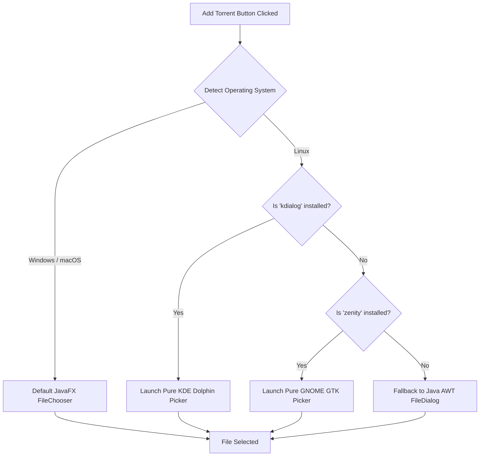

# UI & OS Integration

This project is built using **JavaFX**, but it avoids the traditional pitfalls of Java desktop applications by aggressively tying into native OS features to guarantee a professional, native feel.

## 1. UI Architecture & Data Binding
The UI layout is defined in `src/main/resources/fxml/MainWindow.fxml`. It uses a `StackPane` to toggle visibility between the initial "Welcome Screen" and the "Dashboard Table". 

Because the backend network engine (`Main.java`) runs on Virtual Threads, it is strictly forbidden from directly updating the JavaFX UI elements (which causes immediate thread-safety crashes).
Instead, `Main.java` interacts entirely with a `TorrentModel` object. The `TorrentModel` uses `Platform.runLater()` to safely push UI updates (like speed strings and progress doubles) back to the main Application Thread.

```java
// Safely updating the UI from a background Virtual Thread
public void setProgress(double p) { 
    Platform.runLater(() -> progress.set(p)); 
}
```

## 2. 100% Native File Pickers
By default, if you launch a JavaFX `FileChooser` on a Linux distribution, it often falls back to a legacy, blocky, generic Java popup that ruins the native feel of the application. 

To solve this, `MainWindowController.java` utilizes a highly intelligent, cascading bridge sequence when you click "Add Torrent File". It forces the application to use the exact native file manager installed on your system.


*Note: We included a boolean flag in the code to ensure that if a user clicks "Cancel" on Dolphin, it gracefully exits rather than cascading down to Zenity and AWT.*

## 3. Bypassing Windows Write-Protection
On Windows, applications installed via an `.exe` installer are placed in `C:\Program Files\`, which is heavily write-protected by Windows Administrator protocols to prevent viruses. 

If our app attempted to save a 2GB movie directly into its installation directory (the current working directory `.`), Windows would instantly block the file I/O operations, dropping the download speed to 0 KB/s.

To prevent this, the client dynamically queries the OS for the user's personal Downloads folder and defaults the `FileManager` save path there.
```java
String downloadsDir = System.getProperty("user.home") + File.separator + "Downloads";
FileManager fileManager = new FileManager(downloadsDir, torrent);
```
